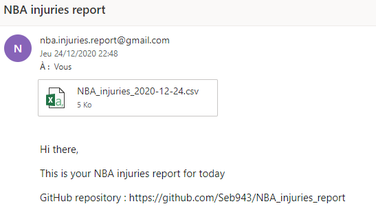

# NBA_injuries_report
:basketball::basketball::basketball: Collect NBA injuries report, organize them in an elegant table, then send it via mail :basketball::basketball::basketball:

:information_source: Utilization:
1. Download/clone the repository 
1. Set your Chrome driver location on line 11 of <i>Scrape_NBA_injuries.py</i>
1. Set your e-mail address on line 18 in <i>Send_mail.py</i>
1. Run the code :+1:

:information_source: The collected table looks like this :  
  
The mail looks like this :  
  

:information_source: Please report any bug/issue in the *issues* section or directly at sebcararo@hotmail.fr (Any feedback is really appreciated :speech_balloon: :+1:). A :star2: is also greatly appreciated :raised_hands:.  
